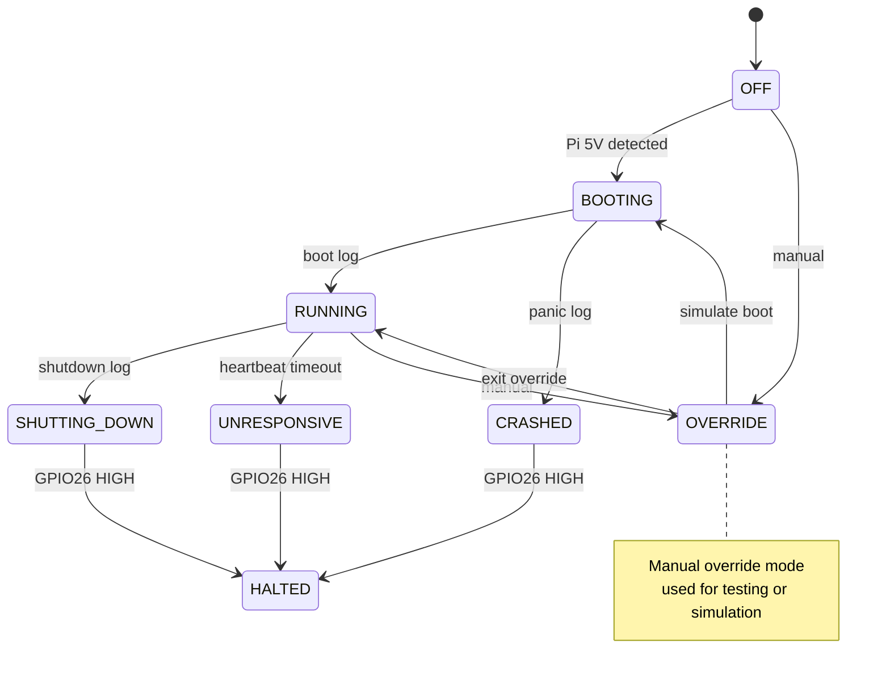

# BMC-Lite HAT – System State Machine and LED Status

This document defines the internal firmware state machine of the BMC-Lite HAT and its corresponding RGB LED feedback patterns. Together, these mechanisms enable real-time monitoring and intuitive diagnostics for headless Raspberry Pi systems.

---

## 🌈 LED Status Mapping

| State            | Color       | Behavior     | Meaning                          |
|------------------|-------------|--------------|----------------------------------|
| Off              | ⚫ Off       | Off          | No Pi power                      |
| Booting          | 🟠 Orange    | Breathing    | Parsing serial boot logs         |
| Running          | 🟢 Green     | Solid        | Heartbeat OK                     |
| Shutting Down    | 🟡 Yellow    | Slow Blink   | Shutdown in progress             |
| Halted           | 🔴 Red       | Solid        | GPIO26 high: safe to power off   |
| Crash / Panic    | 🟣 Magenta   | Fast Blink   | Kernel panic, log detected       |
| Unresponsive     | 🟤 Amber     | 2s Blink     | Heartbeat timeout                |

---

### State Descriptions

- **OFF**: No Pi power (5V not detected)
- **BOOTING**: Serial console active, parsing boot messages
- **RUNNING**: Heartbeat GPIO detected, Pi is healthy
- **SHUTTING_DOWN**: Serial message indicates shutdown
- **UNRESPONSIVE**: Heartbeat GPIO silent (timeout)
- **CRASHED**: Kernel panic or failure detected in serial output
- **HALTED**: GPIO26 pulled HIGH via dtoverlay = safe to power off
- **OVERRIDE**: User override state, for testing or forcing modes

## 🧠 System State Machine

---

## 📝 Notes

- LED color mappings follow conventional metaphors (red = stop, green = go).
- LED behavior is configurable in firmware: blink rate, colors, animations.
- OVERRIDE state can manually trigger test LEDs or simulate boot/poweroff sequences.
- System transitions may also be logged via USB CDC or Telnet CLI (if enabled).

---

## 📚 Related

- [`WIRING.md`](WIRING.md) for heartbeat GPIO and LED wiring
- [`POWER.md`](POWER.md) for power detection behavior
