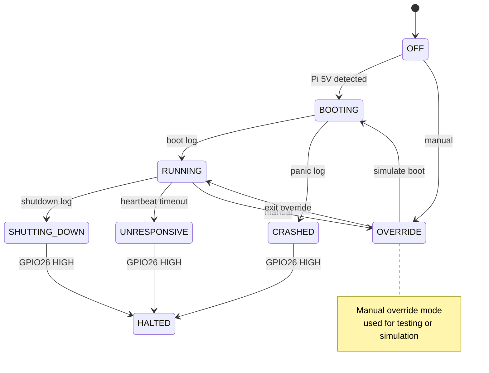

# BMC-Lite-HAT System State Machine

This state machine defines how the microcontroller firmware interprets the system status of a Raspberry Pi connected via GPIO, UART, and other inputs. The LED status reflects the active state to provide intuitive, real-time visual feedback for headless setups.

## Description of States

- **OFF**: No Pi power (5V not detected)
- **BOOTING**: Serial console active, parsing boot messages
- **RUNNING**: Heartbeat GPIO detected, Pi is healthy
- **SHUTTING_DOWN**: Serial message indicates shutdown
- **UNRESPONSIVE**: Heartbeat GPIO silent (timeout)
- **CRASHED**: Kernel panic or failure detected in serial output
- **HALTED**: GPIO26 pulled HIGH via dtoverlay = safe to power off
- **OVERRIDE**: User override state, for testing or forcing modes
